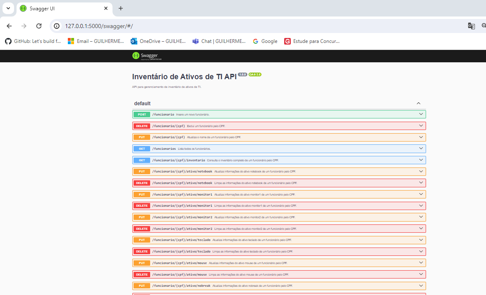
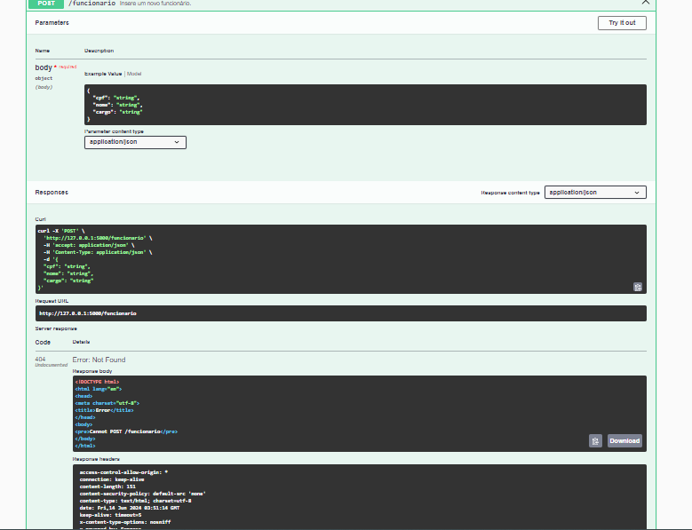
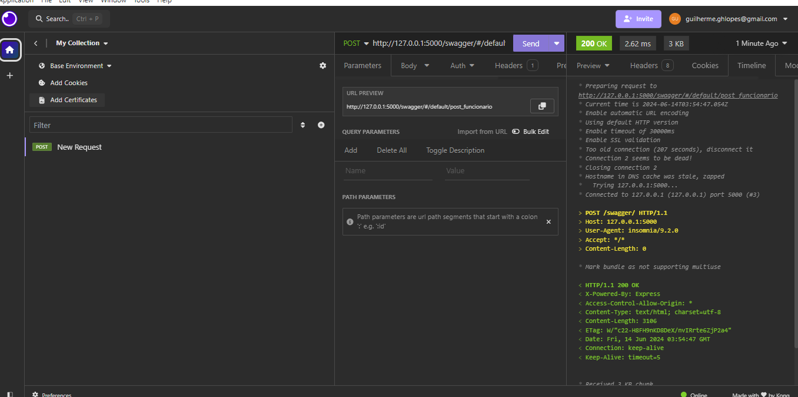

# API de Inventário de Ativos de TI
## Descrição
Esta API permite gerenciar o inventário de ativos de TI de uma empresa, incluindo a gestão de funcionários e seus respectivos ativos.

## Estrutura
- Um funcionário só pode ser excluído se não houver nenhum ativo configurado para ele.
- A quantidade de ativos que um funcionário pode ter não deve ser maior que a especificada na planilha fornecida.

ti_inventario/
├── node_modules/
├── src/
│   ├── controllers/
│   │   ├── funcionarioController.js
│   │   └── ativoController.js
│   ├── models/
│   │   └── funcionarioModel.js
│   ├── routes/
│   │   └── routes.js
|   ├── static/
│   │   └── swagger.json
│   |── app.js
│   └── db.js
├── package.json
└── package-lock.json


## Instalação

### Pré-requisitos
- Node.js instalado
- MongoDB instalado e rodando na máquina local

### Passos para Instalação
1. Clone o repositório:
    ```sh
    git clone https://github.com/guilhermehlopes/ti_inventario.git
    cd ti_inventario
    ```

2. Instale as dependências:
    ```sh
    npm install express
    npm install swagger-ui-express 
    npm install body-parser 
    npm install mongodb
    npm install cors 
    npm install dotenv 
    npm install nodemon --save-dev 
    npm install
    ```

3. Configure a conexão com o MongoDB (se necessário, altere a URL de conexão no arquivo `src/db.js`).

4. Inicie o servidor:
    ```sh
    npm start
    ```

5. O servidor estará rodando em `http://127.0.0.1:5000/swagger/`.

## Endpoints

### Funcionários
- **POST /api/funcionario**: Adiciona um novo funcionário.
- **DELETE /api/funcionario/:cpf**: Exclui um funcionário.
- **GET /api/funcionarios**: Lista todos os funcionários.
- **GET /api/funcionario/:cpf/inventario**: Consulta o inventário completo de um determinado funcionário.
- **PUT /api/funcionario/:cpf**: Atualiza o nome do funcionário.

### Ativos
- **POST /funcionario/:cpf/ativo/(notebook;monitor1;monitor2;teclado;mouse;nobreak;desktop;headset;celular;acessorios)**: Adiciona ativos a um funcionario (diversos tipos)
- **DELETE /funcionario/:cpf/ativo/(notebook;monitor1;monitor2;teclado;mouse;nobreak;desktop;headset;celular;acessorios)**: Deleta ativos a um funcionario (diversos tipos)


## Estrutura
- Um funcionário só pode ser excluído se não houver nenhum ativo configurado para ele.
- A quantidade de ativos que um funcionário pode ter não deve ser maior que a especificada na planilha fornecida.


## Comentarios
Infelizmente esta com erro na rota e nao consegui ajustar :/







